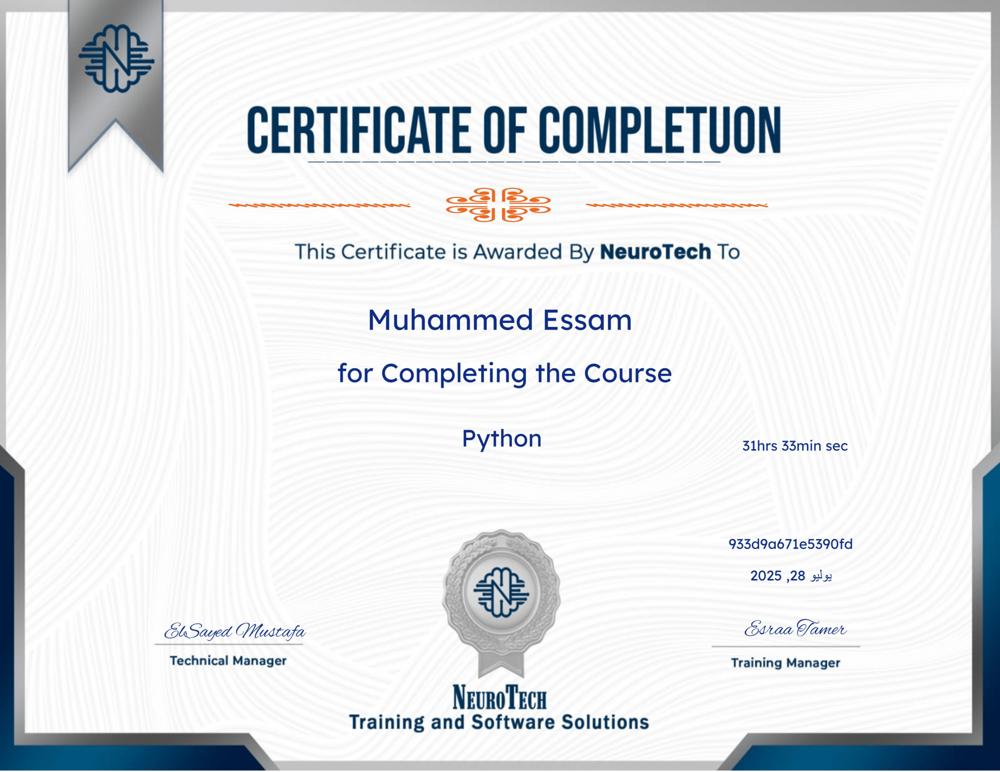

# Python Introduction

Welcome to the **NeuroTech-Python-Introduction** repository! This repo is organized to help you easily navigate lectures, code, notes, quizzes, and mini-projects. Designed for both self-study and team collaboration.

---

---

## Repository Structure

Each folder corresponds to a specific lesson or module.  
Inside each lesson folder, you'll typically find:

- `lecture.pdf` → Lecture slides or PDFs.
- `notes.md` → Personal notes or transcript summaries.
- `code.ipynb` → Code used or explained in the lecture.

There are also:

- `/Assets/` → Visuals used in lectures or summaries.
- `/Quizzes/` → Questions & answers after each section.
- `/Projects/` → Projects done during the course.
- `/Resources/` → External reading, books, helpful links.

---

## Table of Contents

| Module | Description | Link |
|--------|-------------|------|
| #1 | Introduction to Python | [01-introduction-to-python](./01-Lessons/01-introduction-to-python/) |
| #2 | Python Basics | [02-python-basics](./01-Lessons/02-python-basics/) |
| #3 | Python Data Structures | [03-python-data-structures](./01-Lessons/03-python-data-structures/) |
| #4 | Python Basics Practice | [04-python-basics-practice](./01-Lessons/04-python-basics-practice/) |
| #5 | Operators & Exception Handling | [05-operators-and-exception-handling](./01-Lessons/05-operators-and-exception-handling/) |
| #6 | Functions | [06-functions](./01-Lessons/06-functions/) |
| #7 | Practice | [07-practice](./01-Lessons/07-practice/) |
| #8 | File Handling | [08-file-handling](./01-Lessons/08-file-handling/) |
| #9 | OOP | [09-oop](./01-Lessons/09-oop/) |
| #10 | OOP Features | [10-oop-features](./01-Lessons/10-oop-features/) |
| #11 | OOP Practice | [11-oop-practice](./01-Lessons/11-oop-practice/) |
| #12 | Web Scraping | [12-web-scraping](./01-Lessons/12-web-scraping/) |

---

## How to Use

1. Clone the repo.
2. Start with the `01-introduction-to-python` folder.
3. Read the notes → Watch lecture → Run code → Solve quiz.
4. Repeat for each lesson.

---

## Notes

- This template is reusable for all future courses.
- Naming format for folders: `nn-lesson-name`.
- Always keep `notes.md` if exist up to date with your own understanding.
- You can add `.py`, `.ipynb`, `.md`, `.pdf` files depending on the course format.

---

###### “The best way to learn is to teach.” – Richard Feynman
